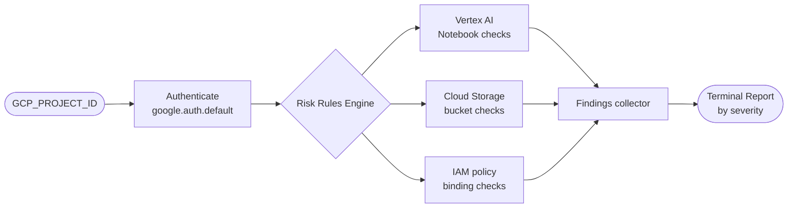

# Risk Analyzer for Google Cloud Platform

A CLI tool that audits Google Cloud Platform projects for security misconfigurations across Vertex AI, Cloud Storage, and IAM — and prints a prioritized risk report to stdout.

---

## Quick Start

```bash
# 1. Clone and install
git clone https://github.com/cdgmx/risk-analyzer-google-cloud-platform.git
cd risk-analyzer-google-cloud-platform
python3 -m venv .venv && source .venv/bin/activate
pip install -e .

# 2. Authenticate and set project
gcloud auth application-default login
export GCP_PROJECT_ID="your-project-id"

# 3. Enable required APIs
gcloud services enable notebooks.googleapis.com storage.googleapis.com cloudresourcemanager.googleapis.com --project=$GCP_PROJECT_ID

# 4. Run
python -m gcp_risk_analyzer
```

---

## How It Works



---

## What It Checks

| Domain | Rule | Severity |
|---|---|---|
| **Vertex AI** | Notebook instance has a public IP | CRITICAL |
| **Vertex AI** | Notebook instance has unrestricted proxy access | HIGH |
| **Cloud Storage** | Bucket public access prevention is `inherited` | HIGH |
| **Cloud Storage** | Bucket has no customer-managed KMS key | MEDIUM |
| **IAM** | Project binding granted to `allUsers` or `allAuthenticatedUsers` | CRITICAL |
| **IAM** | Primitive role (`roles/owner` or `roles/editor`) assigned to any principal | HIGH |
| **IAM** | Service account holds `roles/owner` or `roles/editor` | CRITICAL |

---

## Sample Output

```
==================================================
Google Cloud Platform Risk Analysis Report - Project: my-gcp-project
==================================================

CRITICAL: iam-security - Service account with owner/editor role: serviceAccount:123-compute@developer.gserviceaccount.com
HIGH: iam-security - serviceAccount:123-compute@developer.gserviceaccount.com IAM binding on role: roles/editor
HIGH: storage-security - Bucket with public access prevention inherited: ml-artifacts-bucket
MEDIUM: storage-security - Bucket without default KMS key: training-data-bucket

==================================================
Total findings: 4
  1 CRITICAL
  2 HIGH
  1 MEDIUM
==================================================
```

---

## Requirements

- Python 3.11+
- Google Cloud SDK (`gcloud`) installed and authenticated
- GCP account with `roles/viewer` and `roles/iam.securityReviewer`
- APIs enabled on the target project:
  - `notebooks.googleapis.com`
  - `storage.googleapis.com`
  - `cloudresourcemanager.googleapis.com`

---

## Project Layout

```
risk-analyzer-google-cloud-platform/
├── src/
│   └── gcp_risk_analyzer/
│       ├── __init__.py         # Package exports: GCPRiskAnalyzer, Finding, Severity
│       ├── __main__.py         # Module entry point: python -m gcp_risk_analyzer
│       ├── analyzer.py         # GCPRiskAnalyzer class — checks and orchestration
│       ├── reporter.py         # Report rendering (stateless, stdout)
│       └── models/
│           ├── __init__.py
│           └── finding.py      # Finding dataclass + Severity enum
├── tests/
│   ├── conftest.py             # Shared pytest fixtures
│   ├── unit/
│   │   ├── test_analyzer.py    # Unit tests for GCPRiskAnalyzer
│   │   ├── test_reporter.py    # Unit tests for generate_report()
│   │   └── test_finding_model.py  # Unit tests for Finding / Severity
│   └── integration/
│       └── test_cli_smoke.py   # CLI entry point and import smoke tests
├── .github/workflows/
│   └── ci.yml                  # CI: SAST → dependency scan → tests
├── pyproject.toml
├── pytest.ini
├── requirements.txt
├── requirements-dev.txt
└── README.md
```

---

## Programmatic Usage

```python
from gcp_risk_analyzer.analyzer import GCPRiskAnalyzer
from gcp_risk_analyzer.reporter import generate_report

analyzer = GCPRiskAnalyzer("my-gcp-project")
analyzer.run_all_checks()
# Report is printed to stdout automatically.

# Or inspect findings directly:
for finding in analyzer.findings:
    print(finding.severity, finding.check, finding.message)
```

---

## Testing

```bash
# Install dev dependencies
pip install -r requirements-dev.txt

# Run all tests
pytest

# Unit tests only
pytest tests/unit -q

# Integration smoke tests only
pytest tests/integration/test_cli_smoke.py -q

# With coverage
pytest --cov=gcp_risk_analyzer --cov-report=term-missing
```

---

## CI/CD Pipeline

Three sequential stages run on every push to `main` or `dev` and on pull requests targeting `main`:

1. **SAST** — Bandit scans `src/` at medium severity/confidence threshold.
2. **Dependency scan** — Safety checks `requirements.txt` against known CVEs.
3. **Tests + coverage** — Pytest runs after both security stages pass; minimum 70% coverage enforced.

Security validation runs before functional testing (shift-left).

---

## Roadmap

- JSON and CSV report export formats
- Severity-based exit codes for downstream CI/CD gating
- VPC Service Controls validation for AI APIs
- Cloud Logging audit for Vertex AI model endpoints
- Security Command Center integration

---

## License

MIT — see [LICENSE](LICENSE).

---

## Maintainer

Christian Dave Montalban
